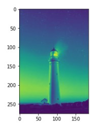
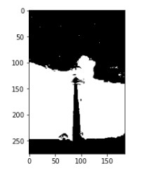
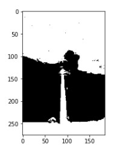
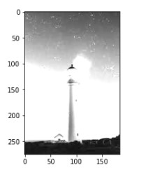
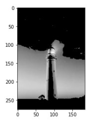
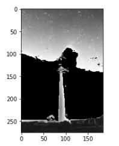
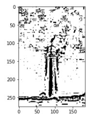
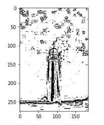
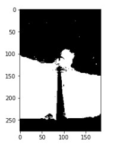

# Thresholding of Images
# AIM:
To segment the image using global thresholding, adaptive thresholding and Otsu's thresholding using python and OpenCV.

# SOFTWARE REQUIRED:
1. Anaconda - Python 3.7
2. OpenCV

# ALGORITHM:

## Step 1:
Import packages cv2 and matplotlib.


## Step 2:
Read the image and convert it into grayscale image.


## Step 3:
Perform Global thresholding method.


## Step 4:
Perform Adaptive thresholding method.


## Step 5:
Perform optimum global thresholding by otsu method.

## Step 6:
Run the programs and show the outputs.


# PROGRAM:
```
Program developed by: R.SOMEASVAR
Register number: 212221230103
```


# Load the necessary packages:
```
import cv2
import matplotlib.pyplot as plt
```


# Read the Image and convert to grayscale:
```
BGR_image=cv2.imread('light.jpg')
gray=cv2.cvtColor(BGR_image,cv2.COLOR_BGR2GRAY)
plt.imshow(gray)
```


# Use Global thresholding to segment the image:
```
ret,thresh1=cv2.threshold(gray,100,255,cv2.THRESH_BINARY )
ret,thresh2=cv2.threshold(gray,100,255,cv2.THRESH_BINARY_INV)
ret,thresh3=cv2.threshold(gray,100,255,cv2.THRESH_TRUNC)
ret,thresh4=cv2.threshold(gray,100,255,cv2.THRESH_TOZERO)
ret,thresh5=cv2.threshold(gray,100,255,cv2.THRESH_TOZERO_INV)
```


# Use Adaptive thresholding to segment the image:
```
th1=cv2.adaptiveThreshold(gray,255,cv2.ADAPTIVE_THRESH_MEAN_C,cv2.THRESH_BINARY,11,2)
th2=cv2.adaptiveThreshold(gray,255,cv2.ADAPTIVE_THRESH_GAUSSIAN_C,cv2.THRESH_BINARY,11,2)

```


# Use Otsu's method to segment the image:
```
ret,th7=cv2.threshold(gray,0,255,cv2.THRESH_BINARY+cv2.THRESH_OTSU)
```


# Display the results:
```
plt.imshow(thresh1,cmap='gray')
plt.imshow(thresh2,cmap='gray')
plt.imshow(thresh3,cmap='gray')
plt.imshow(thresh4,cmap='gray')
plt.imshow(thresh5,cmap='gray')
plt.imshow(th1,cmap='gray')
plt.imshow(th2,cmap='gray')
plt.imshow(th7,cmap='gray')
```


# OUTPUT:

## Original Image:


## Greyscale image:



## Global Thresholding:






## Adaptive Thresholding:



## Optimum Global Thesholding using Otsu's Method:



# RESULT:
Thus the images are segmented using global thresholding, adaptive thresholding and optimum global thresholding using python and OpenCV.

